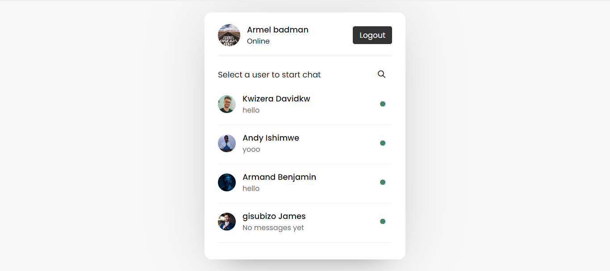
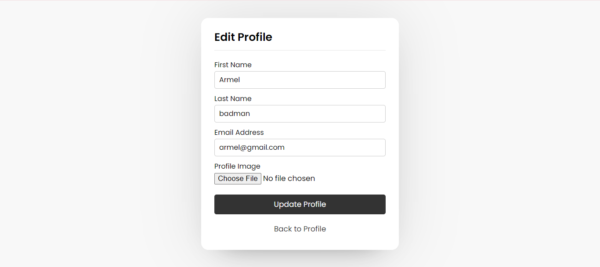

# Realtime Chat Application

## Description
This is a real-time chat application built with PHP and JavaScript. It allows users to register, log in, and engage in one-on-one conversations with other users. The application features real-time message updates, online/offline status indicators, and a user-friendly interface.

## Features
- User registration and authentication
- Real-time messaging
- Online/offline status updates
- User search functionality
- Profile management (including profile picture uploads)
- Responsive design for desktop and mobile devices

## Technologies Used
- PHP 7.4+
- MySQL
- JavaScript (with AJAX for real-time updates)
- HTML5
- CSS3
- Font Awesome for icons

## Installation

1. Clone the repository:
   git clone [https://github.com/yourusername/realtime-chat-app.git](https://github.com/yourusername/realtime-chat-app.git)

2. Set up your web server (e.g., Apache) to serve the project directory.

3. Create a MySQL database for the application.

4. Import the database schema:
   mysql -u your_username -p your_database_name < database.sql

5. Configure the database connection:
- Open `config.php`
- Update the database credentials:
  ```php
  $db_host = 'localhost';
  $db_name = 'your_database_name';
  $db_user = 'your_username';
  $db_pass = 'your_password';
  ```

6. Ensure the `uploads` directory has write permissions:
   
## Usage

1. Access the application through your web browser.

2. Register a new account or log in with existing credentials.

3. On the main page, you'll see a list of all users. Click on a user to start a chat.

4. Use the search bar to find specific users.

5. Click on your profile picture to access profile management options.

## File Structure

- `index.php`: Landing page and login form
- `signup.php`: User registration page
- `user.php`: Main user interface showing all users
- `chat.php`: Individual chat interface
- `profile.php`: User profile page
- `edit-profile.php`: Profile editing page
- `config.php`: Database configuration
- `style.css`: Main stylesheet
- `javascript/`: Directory containing JavaScript files
- `users.js`: Handles user list functionality
- `chat.js`: Manages real-time chat functionality

## Contributing

Contributions are welcome! Please feel free to submit a Pull Request.

## License

This project is open source and available under the [MIT License](LICENSE).

## Contact

If you have any questions, feel free to reach out to [armandbenjamin30@gmail.com](mailto:armandbenjamin30@gmail.com).
## Screenshot
# Login form

# user interface

# chat interface

# edit profile interface

# profile interface

